# مخطط قاعدة البيانات (ERD) - نظام إدارة المهام

## 📊 ERD Diagram (Mermaid)

```mermaid
erDiagram
    %% ============================================
    %% الجداول الأساسية
    %% ============================================
    
    USERS {
        bigint id PK
        string name
        string email UK
        string password
        string avatar
        string phone
        string job_title
        text bio
        string timezone
        string language
        boolean is_owner
        boolean is_active
        timestamp email_verified_at
        timestamp last_login_at
        timestamp created_at
        timestamp updated_at
    }
    
    TEAMS {
        bigint id PK
        string name
        string slug UK
        text description
        string logo
        string color
        boolean is_active
        int max_members
        json settings
        bigint owner_id FK
        timestamp created_at
        timestamp updated_at
        timestamp deleted_at
    }
    
    PROJECTS {
        bigint id PK
        string name
        string slug UK
        text description
        string color
        decimal budget
        string currency
        decimal progress_percentage
        bigint team_id FK
        bigint owner_id FK
        date start_date
        date end_date
        enum status
        boolean is_archived
        timestamp archived_at
        bigint archived_by FK
        timestamp created_at
        timestamp updated_at
        timestamp deleted_at
    }
    
    TASKS {
        bigint id PK
        bigint project_id FK
        bigint team_id FK
        bigint assigned_to FK
        bigint parent_task_id FK
        string title
        text description
        enum status
        enum priority
        date start_date
        date due_date
        decimal estimated_hours
        decimal actual_hours
        decimal progress_percentage
        timestamp completed_at
        text blocking_reason
        boolean is_recurring
        string recurrence_pattern
        int order
        bigint created_by FK
        timestamp created_at
        timestamp updated_at
        timestamp deleted_at
    }
    
    %% ============================================
    %% جداول العلاقات Many-to-Many
    %% ============================================
    
    TEAM_USER {
        bigint id PK
        bigint team_id FK
        bigint user_id FK
        enum role
        timestamp created_at
        timestamp updated_at
        timestamp deleted_at
    }
    
    PROJECT_USER {
        bigint id PK
        bigint project_id FK
        bigint user_id FK
        enum role
        timestamp created_at
        timestamp updated_at
        timestamp deleted_at
    }
    
    TASK_USER {
        bigint id PK
        bigint task_id FK
        bigint user_id FK
        timestamp created_at
        timestamp updated_at
        timestamp deleted_at
    }
    
    %% ============================================
    %% نظام الصلاحيات
    %% ============================================
    
    ROLES {
        bigint id PK
        string name
        string slug UK
        text description
        boolean is_system
        timestamp created_at
        timestamp updated_at
    }
    
    PERMISSIONS {
        bigint id PK
        string name
        string slug UK
        text description
        string group
        timestamp created_at
        timestamp updated_at
    }
    
    ROLE_PERMISSION {
        bigint id PK
        bigint role_id FK
        bigint permission_id FK
        timestamp created_at
        timestamp updated_at
    }
    
    ROLE_USER {
        bigint id PK
        bigint role_id FK
        bigint user_id FK
        string entity_type
        bigint entity_id
        timestamp created_at
        timestamp updated_at
    }
    
    %% ============================================
    %% نظام الإشعارات
    %% ============================================
    
    NOTIFICATIONS {
        uuid id PK
        string type
        string notifiable_type
        bigint notifiable_id
        text data
        timestamp read_at
        timestamp created_at
        timestamp updated_at
    }
    
    NOTIFICATION_SETTINGS {
        bigint id PK
        bigint user_id FK
        json email_notifications
        json push_notifications
        json database_notifications
        timestamp created_at
        timestamp updated_at
    }
    
    %% ============================================
    %% نظام التعليقات والمرفقات
    %% ============================================
    
    COMMENTS {
        bigint id PK
        string commentable_type
        bigint commentable_id
        bigint user_id FK
        bigint parent_id FK
        text content
        boolean is_edited
        timestamp edited_at
        timestamp created_at
        timestamp updated_at
        timestamp deleted_at
    }
    
    ATTACHMENTS {
        bigint id PK
        string attachable_type
        bigint attachable_id
        bigint user_id FK
        string file_name
        string file_original_name
        string file_path
        bigint file_size
        string file_type
        string file_extension
        boolean is_image
        string thumbnail_path
        timestamp created_at
        timestamp deleted_at
    }
    
    %% ============================================
    %% سجل الأنشطة والدعوات
    %% ============================================
    
    ACTIVITY_LOGS {
        bigint id PK
        bigint user_id FK
        string subject_type
        bigint subject_id
        string action
        text description
        json properties
        string ip_address
        text user_agent
        timestamp created_at
    }
    
    INVITATIONS {
        bigint id PK
        string invitable_type
        bigint invitable_id
        bigint inviter_id FK
        string invitee_email
        bigint invitee_id FK
        string role
        string token UK
        enum status
        timestamp expires_at
        timestamp accepted_at
        timestamp rejected_at
        timestamp created_at
        timestamp updated_at
    }
    
    %% ============================================
    %% Time Tracking
    %% ============================================
    
    TIME_ENTRIES {
        bigint id PK
        bigint task_id FK
        bigint user_id FK
        text description
        timestamp started_at
        timestamp ended_at
        int duration_minutes
        boolean is_billable
        decimal hourly_rate
        timestamp created_at
        timestamp updated_at
    }
    
    %% ============================================
    %% Tags والوسوم
    %% ============================================
    
    TAGS {
        bigint id PK
        string name
        string slug UK
        string color
        bigint created_by FK
        timestamp created_at
        timestamp updated_at
    }
    
    TAGGABLES {
        bigint id PK
        bigint tag_id FK
        string taggable_type
        bigint taggable_id
        timestamp created_at
        timestamp updated_at
    }
    
    %% ============================================
    %% Task Checklist
    %% ============================================
    
    TASK_CHECKLIST_ITEMS {
        bigint id PK
        bigint task_id FK
        string title
        boolean is_completed
        bigint completed_by FK
        timestamp completed_at
        int order
        timestamp created_at
        timestamp updated_at
    }
    
    %% ============================================
    %% Custom Fields
    %% ============================================
    
    CUSTOM_FIELDS {
        bigint id PK
        string entity_type
        string name
        enum field_type
        json options
        boolean is_required
        int order
        bigint created_by FK
        timestamp created_at
        timestamp updated_at
    }
    
    CUSTOM_FIELD_VALUES {
        bigint id PK
        bigint custom_field_id FK
        string entity_type
        bigint entity_id
        text value
        timestamp created_at
        timestamp updated_at
    }
    
    %% ============================================
    %% Templates
    %% ============================================
    
    PROJECT_TEMPLATES {
        bigint id PK
        string name
        text description
        json structure
        bigint created_by FK
        boolean is_public
        int usage_count
        timestamp created_at
        timestamp updated_at
    }
    
    TASK_TEMPLATES {
        bigint id PK
        string name
        text description
        json checklist
        decimal estimated_hours
        enum priority
        bigint created_by FK
        timestamp created_at
        timestamp updated_at
    }
    
    %% ============================================
    %% Milestones والتبعيات
    %% ============================================
    
    MILESTONES {
        bigint id PK
        bigint project_id FK
        string name
        text description
        date due_date
        enum status
        timestamp completed_at
        int order
        timestamp created_at
        timestamp updated_at
        timestamp deleted_at
    }
    
    TASK_DEPENDENCIES {
        bigint id PK
        bigint task_id FK
        bigint depends_on_task_id FK
        enum dependency_type
        int lag_days
        timestamp created_at
        timestamp updated_at
    }
    
    %% ============================================
    %% المفضلة والمشاهدات
    %% ============================================
    
    FAVORITES {
        bigint id PK
        bigint user_id FK
        string favoritable_type
        bigint favoritable_id
        timestamp created_at
        timestamp updated_at
    }
    
    RECENT_VIEWS {
        bigint id PK
        bigint user_id FK
        string viewable_type
        bigint viewable_id
        timestamp viewed_at
        int view_count
    }
    
    %% ============================================
    %% الإعدادات والتقارير
    %% ============================================
    
    USER_SETTINGS {
        bigint id PK
        bigint user_id FK
        json notifications
        json preferences
        json privacy
        timestamp created_at
        timestamp updated_at
    }
    
    DASHBOARD_WIDGETS {
        bigint id PK
        bigint user_id FK
        string widget_type
        int position
        enum size
        json settings
        boolean is_visible
        timestamp created_at
        timestamp updated_at
    }
    
    REPORTS {
        bigint id PK
        string name
        text description
        enum report_type
        json filters
        bigint created_by FK
        boolean is_scheduled
        enum schedule_frequency
        timestamp last_run_at
        timestamp created_at
        timestamp updated_at
    }
    
    %% ============================================
    %% العلاقات (Relationships)
    %% ============================================
    
    %% Users
    USERS ||--o{ TEAMS : "owns"
    USERS ||--o{ PROJECTS : "owns"
    USERS ||--o{ TASKS : "creates"
    USERS ||--o{ TASKS : "assigned_to"
    USERS ||--o{ TEAM_USER : "member_of"
    USERS ||--o{ PROJECT_USER : "member_of"
    USERS ||--o{ TASK_USER : "assigned"
    
    %% Teams
    TEAMS ||--o{ PROJECTS : "has"
    TEAMS ||--o{ TASKS : "has"
    TEAMS ||--o{ TEAM_USER : "has_members"
    
    %% Projects
    PROJECTS ||--o{ TASKS : "contains"
    PROJECTS ||--o{ PROJECT_USER : "has_members"
    PROJECTS ||--o{ MILESTONES : "has"
    
    %% Tasks
    TASKS ||--o{ TASKS : "parent_of"
    TASKS ||--o{ TASK_USER : "assigned_to"
    TASKS ||--o{ TASK_CHECKLIST_ITEMS : "has"
    TASKS ||--o{ TIME_ENTRIES : "tracked_in"
    TASKS ||--o{ TASK_DEPENDENCIES : "depends_on"
    TASKS ||--o{ TASK_DEPENDENCIES : "required_by"
    
    %% Permissions
    ROLES ||--o{ ROLE_PERMISSION : "has"
    PERMISSIONS ||--o{ ROLE_PERMISSION : "assigned_to"
    ROLES ||--o{ ROLE_USER : "assigned_to"
    USERS ||--o{ ROLE_USER : "has"
    
    %% Comments & Attachments (Polymorphic)
    USERS ||--o{ COMMENTS : "writes"
    USERS ||--o{ ATTACHMENTS : "uploads"
    COMMENTS ||--o{ COMMENTS : "replies_to"
    
    %% Activity & Invitations
    USERS ||--o{ ACTIVITY_LOGS : "performs"
    USERS ||--o{ INVITATIONS : "sends"
    USERS ||--o{ INVITATIONS : "receives"
    
    %% Time Tracking
    USERS ||--o{ TIME_ENTRIES : "logs"
    
    %% Tags
    USERS ||--o{ TAGS : "creates"
    TAGS ||--o{ TAGGABLES : "tagged_as"
    
    %% Custom Fields
    USERS ||--o{ CUSTOM_FIELDS : "creates"
    CUSTOM_FIELDS ||--o{ CUSTOM_FIELD_VALUES : "has"
    
    %% Templates
    USERS ||--o{ PROJECT_TEMPLATES : "creates"
    USERS ||--o{ TASK_TEMPLATES : "creates"
    
    %% Settings & Widgets
    USERS ||--o{ USER_SETTINGS : "has"
    USERS ||--o{ NOTIFICATION_SETTINGS : "has"
    USERS ||--o{ DASHBOARD_WIDGETS : "customizes"
    USERS ||--o{ REPORTS : "creates"
    
    %% Favorites & Recent Views
    USERS ||--o{ FAVORITES : "bookmarks"
    USERS ||--o{ RECENT_VIEWS : "views"
```



## 📋 شرح العلاقات الرئيسية

### 1. المستخدمون والفرق
- المستخدم يمكنه **امتلاك** عدة فرق (One-to-Many)
- المستخدم يمكنه **الانضمام** لعدة فرق (Many-to-Many عبر team_user)

### 2. الفرق والمشاريع
- الفريق يمكنه **امتلاك** عدة مشاريع (One-to-Many)
- المشروع ينتمي إلى فريق واحد (اختياري)

### 3. المشاريع والمهام
- المشروع يحتوي على عدة مهام (One-to-Many)
- المهمة تنتمي إلى مشروع واحد

### 4. المهام والمستخدمون
- المهمة يمكن تعيينها لعدة مستخدمين (Many-to-Many عبر task_user)
- المهمة لها مسؤول رئيسي واحد (assigned_to)
- المهمة لها منشئ واحد (created_by)

### 5. المهام الفرعية
- المهمة يمكن أن تحتوي على مهام فرعية (Self-Referencing)
- المهمة الفرعية لها أب واحد (parent_task_id)

### 6. Polymorphic Relations
#### Comments (التعليقات)
- يمكن إضافة تعليقات على:
  - المهام (Tasks)
  - المشاريع (Projects)

#### Attachments (المرفقات)
- يمكن إرفاق ملفات على:
  - المهام (Tasks)
  - المشاريع (Projects)
  - التعليقات (Comments)

#### Taggables (الوسوم)
- يمكن إضافة وسوم على:
  - المهام (Tasks)
  - المشاريع (Projects)

#### Activity Logs (سجل الأنشطة)
- يتم تسجيل الأنشطة على:
  - المهام (Tasks)
  - المشاريع (Projects)
  - الفرق (Teams)
  - المستخدمين (Users)

#### Invitations (الدعوات)
- يمكن إرسال دعوات لـ:
  - الفرق (Teams)
  - المشاريع (Projects)

#### Favorites (المفضلة)
- يمكن إضافة للمفضلة:
  - المهام (Tasks)
  - المشاريع (Projects)
  - الفرق (Teams)

#### Recent Views (المشاهدات الأخيرة)
- يتم تتبع المشاهدات على:
  - المهام (Tasks)
  - المشاريع (Projects)
  - الفرق (Teams)

### 7. نظام الصلاحيات
- **Role** يحتوي على عدة **Permissions** (Many-to-Many)
- **User** يمكنه الحصول على عدة **Roles** (Many-to-Many)
- الصلاحيات يمكن أن تكون:
  - عامة (على مستوى النظام)
  - خاصة بكيان معين (Team, Project) عبر entity_type و entity_id

### 8. Task Dependencies (التبعيات)
- المهمة يمكن أن **تعتمد على** مهام أخرى
- أنواع التبعيات:
  - **finish_to_start**: المهمة B لا تبدأ حتى تنتهي A
  - **start_to_start**: المهمة B تبدأ عندما تبدأ A
  - **finish_to_finish**: المهمة B تنتهي عندما تنتهي A

---

## 🎯 إحصائيات النظام

### عدد الجداول الإجمالي: **42 جدول**

#### التصنيف:
1. **الجداول الأساسية**: 4 جداول
   - Users, Teams, Projects, Tasks

2. **جداول العلاقات**: 7 جداول
   - team_user, project_user, task_user
   - role_permission, role_user
   - taggables, custom_field_values

3. **نظام الصلاحيات**: 4 جداول
   - roles, permissions, role_permission, role_user

4. **نظام الإشعارات**: 2 جداول
   - notifications, notification_settings

5. **نظام التعليقات والمرفقات**: 2 جداول
   - comments, attachments

6. **نظام التتبع**: 4 جداول
   - activity_logs, invitations, time_entries, task_checklist_items

7. **نظام الوسوم والتصنيف**: 4 جداول
   - tags, taggables, custom_fields, custom_field_values

8. **القوالب**: 2 جداول
   - project_templates, task_templates

9. **Milestones والتبعيات**: 2 جداول
   - milestones, task_dependencies

10. **المفضلة والمشاهدات**: 2 جداول
    - favorites, recent_views

11. **الإعدادات والتقارير**: 4 جداول
    - user_settings, notification_settings, dashboard_widgets, reports

12. **جداول Laravel الأساسية**: 3 جداول
    - password_reset_tokens, sessions, personal_access_tokens

---

## 🔍 Indexes الموصى بها

### جداول المستخدمين
```sql
users: email, is_active, last_login_at
teams: slug, owner_id, is_active
projects: slug, team_id, owner_id, status, is_archived
tasks: project_id, team_id, assigned_to, status, priority, due_date, order
```

### جداول العلاقات
```sql
team_user: (team_id, user_id), deleted_at
project_user: (project_id, user_id), deleted_at
task_user: (task_id, user_id), deleted_at
```

### نظام الصلاحيات
```sql
roles: slug
permissions: slug, group
role_permission: (role_id, permission_id)
role_user: (user_id, entity_type, entity_id)
```

### Polymorphic Relations
```sql
comments: (commentable_type, commentable_id), user_id
attachments: (attachable_type, attachable_id), user_id
activity_logs: (subject_type, subject_id), user_id, created_at
invitations: (invitable_type, invitable_id), token, status
taggables: (taggable_type, taggable_id), tag_id
```

### أخرى
```sql
notifications: (notifiable_type, notifiable_id, read_at)
time_entries: (task_id, user_id), started_at
task_dependencies: (task_id, depends_on_task_id)
milestones: (project_id, status)
```

---

## 💾 حجم قاعدة البيانات المتوقع

### لنظام متوسط الحجم (100 مستخدم، 50 فريق، 500 مشروع، 10,000 مهمة):

| الجدول | عدد السجلات المتوقع | الحجم التقريبي |
|-------|---------------------|----------------|
| users | 100 | 50 KB |
| teams | 50 | 25 KB |
| projects | 500 | 200 KB |
| tasks | 10,000 | 5 MB |
| comments | 5,000 | 2 MB |
| attachments | 2,000 | 1 MB (metadata) |
| activity_logs | 50,000 | 20 MB |
| notifications | 10,000 | 3 MB |
| time_entries | 15,000 | 5 MB |

**الإجمالي التقريبي**: ~40 MB (بدون الملفات المرفقة الفعلية)

---

**ملاحظة**: هذا المخطط يمثل النظام الكامل بعد تطبيق جميع التحسينات المقترحة.
